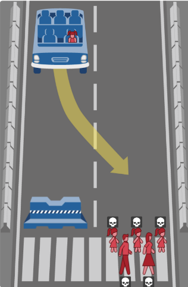
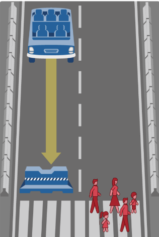
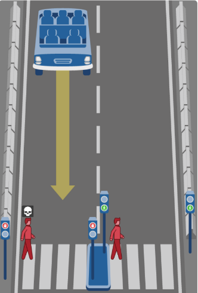
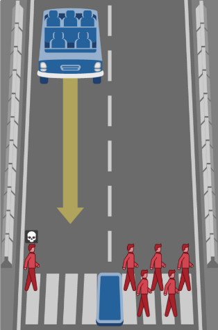
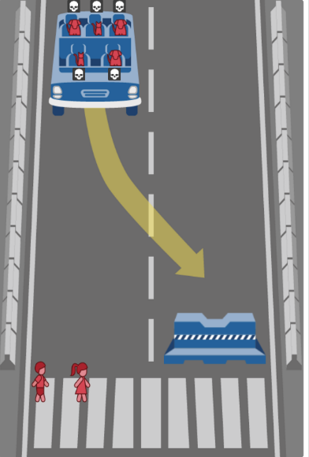

#Diseño de Sistema basado en agentes

##Índice
* Escenario
* Agente
* Percepciones
1. Acciones
2. Objetivo
3. Entorno
* Arquitectura
* Toma de decisiones
* Miembros

##Escenario

Nuestro escenario es la recogida de pasajeros por parte de una flota de coches inteligentes o autónomos utilizando estrategias de búsquedas. Donde esta flota de coches autónomas deberá ir al punto marcado recorriendo el camino mínimo y con el mayor número posible de pasajeros.

##Agente
Nuestro agente es un coche inteligente autónomo. Deberá ir desde el punto A hasta el punto B e ir evitando los diferentes obstáculos que se encuentre por el camino. Durante el trayecto deberá recoger al mayor número de pasajeros si fuese posible.

###Percepciones
* La velocidad a la que va.
* Si lleva pasajeros y cuántos.
* Ambiente atmosférico.
* Sensores de movimiento y cámaras para detectar obstáculos.
* Si la casilla actual hay un pasajero para ser recogido
* Si en las casillas adyacentes (no diagonales) hay obstáculos
* Destino final del sistema inteligente
* Camino que lleva recorrido

###Acciones
* legar desde el punto A hasta el B con el recorrido mínimo.
* Asegurar en la medida de lo posible, si hubiese, la vida del pasajero
* Minimizar costes del coche, es decir, desplazarse a la casilla mínima no ocupada
* Recoger el mayor número de pasajeros dentro del camino mínimo
* Si la siguiente casilla es un obstáculo, evitarla teniendo en cuenta los criterios de agente elegido.

###Objetivo
* Llegar al punto destino, si fuese posible.
* Asegurar en la medida de lo posible, si hubiese, la vida del pasajero
* En caso de accidente, minimizar el número de víctimas.

###Entorno
El entorno se puede suponer rectangular de dimensiones M x N y constituido por celdas libres y ocupadas, dónde coche autónomo puede efectuar acciones de movimiento, una cada vez, desde la casilla actual a una de las 4-vecinas (Norte, Sur, Este u Oeste) que no se encuentre ocupada. Las casillas ocupadas corresponden a obstáculos. Las casillas libres corresponden con celdas libres de obstáculos.

##Arquitectura

El agente, coche autónomo en este caso, deberá partir de un punto inicial hasta un punto final evitando obstáculos y aplicando el camino mínimo entre ambas distancias Durante el camino deberá recoger los pasajeros que sean posibles, y se encontrará con obstáculos que deberá esquivar en la medida de lo posible, para ello, siguiendo el modelo de agente basado en utilidad, deberá considerar la acción a tomar en base a minimizar el número de personas accidentadas.

Al tratarse de un sistema comercial, nuestro modelo de agente tendrá una pequeña modificación; se deberá priorizar la(s) vida(s) de los pasajero(s) del sistema autónomo en el caso que hubiesen, puesto que desde el punto de vista comercial no tiene sentido no garantizar la vida de los consumidores/compradores de nuestro producto, el coche inteligente.

Si en el coche no hubiese pasajero(s) ocupándolo, la toma decisiones respecto a evitar los obstáculos de las casillas ocupadas se regirá teniendo en cuenta el punto nº 4 “Toma de decisiones”, donde se analizarán los distintos casos que pueden darse, así como los factores que entran en juego y una posible solución a cada uno de ellos.

##Toma de decisiones

* Caso 1: En caso de que el coche lleve en su interior algún pasajero, siempre se intentará salvar la vida de estos, sin tener en cuenta el número de muerte de peatones que pueda causar.

* Caso 2: En caso de que el coche se encuentre vació, siempre se intentará salvar la vida de los peatones, sin importar los daños que se puedan ocasionar en el coche.

* Caso 3: En caso de que el coche tenga que decidir entre dos grupos de personas y existan semáforos o señales que regulen su paso, se optará por salvar a aquellas personas que se encuentren cruzando de manera legal.

* Caso 4: En caso de que el coche tenga que decidir entre dos grupos de personas y no exista ningún tipo de regulación (señales o semáforos), se deberá intentar salvar el mayor número de personas, siempre teniendo por presente que los miembros del coche deben salir ilesos.

* Caso 5: El único caso en el que se intentará salvar la vida de los peatones por encima de los ocupantes del coche será cuando estos solo sean mascotas.

